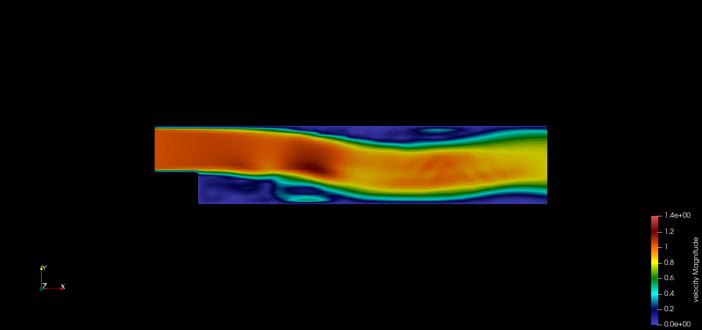
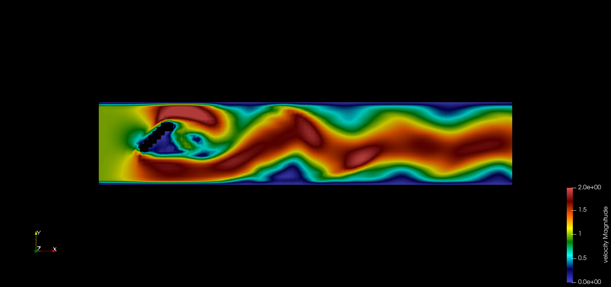
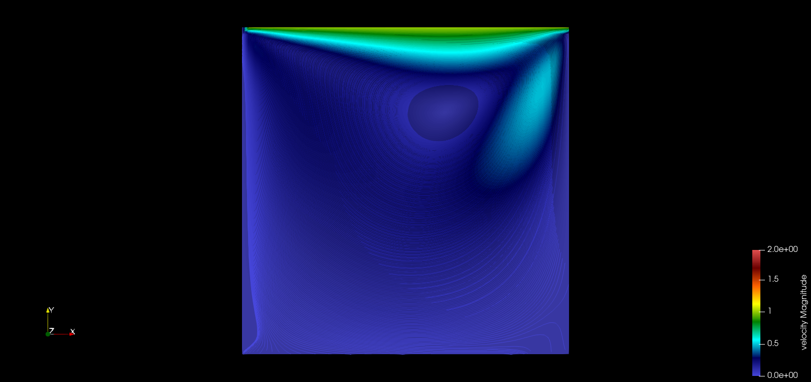

# Running the code
In addition to the instructions provided in the main README.md file, there is an additional implementation for running various examples cases provided in the repository. 

```shell
git clone https://gitlab.lrz.de/oguzziya/GroupX_CFDLab.git
cd GroupX_CFDLab
mkdir build && cd build
cmake ..
make
```

After `make` completes successfully, you will get an executable `fluidchen` in your `build` directory. 

In order to run **Fluidchen**, the case file should be given as input parameter. Some default case files are located in the `example_cases` directory. Navigate to the `build/` directory and run:

```shell
./fluidchen file_name
```
where file_name can be the name of any of the 6 cases provided in the example cases folder. Remember to give the file_name without any extension like `.dat`
This will run the case file and create the output folder `../example_cases/file_name/file_name_Output`, which holds the `.vtk` files of the solution.

# Results and Discussion
## 1.3 and 1.4

All the tasks mentioned in `Section 1.3 and 1.4` of the worksheet have been implemented and the visualizations of the example cases are shown below for reference. Using the base parameters from 1.4, the converged solution was visualized and verified against the posted solution on Moodle. The results are similar to the sample solution, thus verifying the correctness of our code.

<div align="center">
  
</div>

<div align="center">
  
</div>

<div align="center">
  
</div>


