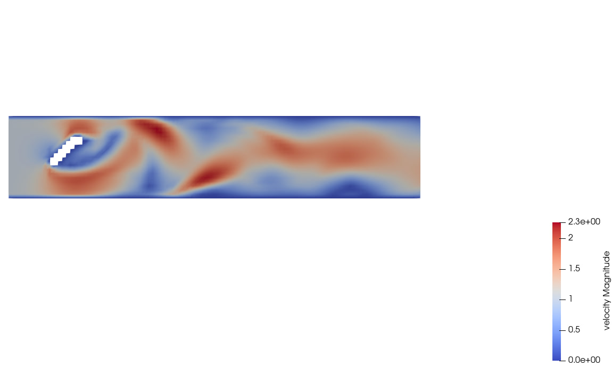
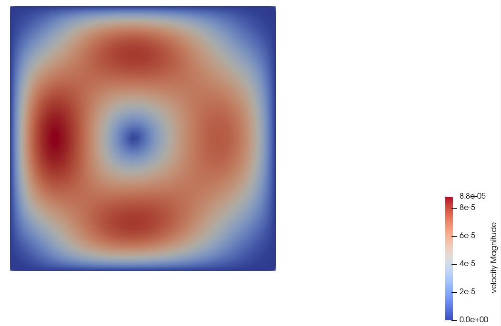
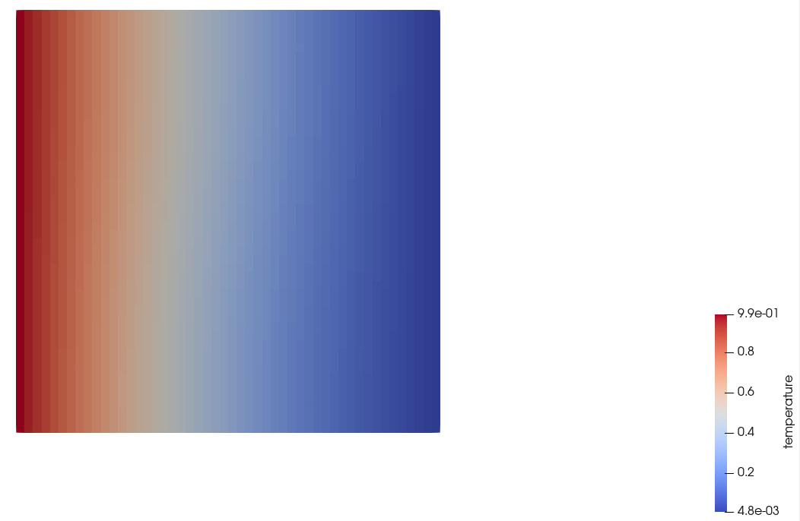

# Running the code
In addition to the instructions provided in the main README.md file, there is an additional implementation for running various examples cases provided in the repository. 

```shell
git clone https://gitlab.lrz.de/oguzziya/GroupX_CFDLab.git
cd GroupX_CFDLab
mkdir build && cd build
cmake ..
make
```

After `make` completes successfully, you will get an executable `fluidchen` in your `build` directory. 

In order to run **Fluidchen**, the case file should be given as input parameter. Some default case files are located in the `example_cases` directory. Navigate to the `build/` directory and run:

```shell
./fluidchen file_name
```
where file_name can be the name of any of the 6 cases provided in the example cases folder. Remember to give the file_name without any extension like `.dat`
This will run the case file and create the output folder `../example_cases/file_name/file_name_Output`, which holds the `.vtk` files of the solution.

# Results and Discussion
## 1.3 and 1.4

All the tasks mentioned in `Section 1.3 and 1.4` of the worksheet have been implemented and the visualizations of the example cases are shown below for reference. Using the base parameters from 1.4, the converged solution was visualized and verified against the posted solution on Moodle. The results are similar to the sample solution, thus verifying the correctness of our code.

## The Lid Driven Cavity
<div align="center">
  
  <figcaption>Velocity Surface Plot</figcaption>
</div>
One of the requirements of this worksheet was to preserve what was already implemented previously. As can be seen from the velocity surface plot for lid driven cavity, the accuracy of results in this case is maintained.

## Task 1.4(b) The Karman Vortex Street 
<div align="center">
  
  <figcaption>Velocity Surface Plot</figcaption>
</div>
The fluid inflow was set to u = 1.0 and v = 0.0. The upper and Lower boundaries have no slip boundary conditions imposed. The results from the surface plot is consistent with the sample output. The velocity has a minimum value of 0 at the boundaries and also right behind the areas of the obstacle.

## Task 1.4(c) Channel flow with a backward facing step 
<div align="center">
  
  <figcaption>Velocity Surface Plot</figcaption>
</div>
The inflow conditions in this case was set to u = 1.0 and v = 0.0. The boundary conditions imposed where no-slip conditions at the upper and lower walls. The geometry file creates an onstacle domain representing a square filling up half of the channel height. The results as can be seen from the velocity surface plot seems to be consistent with the sample output.

## Task 2.2(d) Natural Convection
<div align="center">
  
  <figcaption>Velocity Surface Plot</figcaption>
</div>
In this case, the heat equation was used to calculate the temperature values. As can be seen from the velocity surface plots, the fluid appears to have a circular motion in between the hot and cold walls. It is also interesting that the velocity is zero around the center of the domain.

<div align="center">
  
  <figcaption>Temperature Surface Plot</figcaption>
</div>
The temperatures at the boundaries where applied as boundary conditions. The results shown here where obtained with the first set of values provided in the worksheet with a dt value of 10. As expected, the temperature values at the end of the simulation shows that the heat flow is infact from the hot walls towards the cold and insulated walls.

## 2.1 and 2.2

All the tasks mentioned in `Section 2.1 and 2.2` of the worksheet have been implemented. However, some issues were encountered during the simulation. The residulas are diverging giving a value of Inf or NaN for RayleighBenard case and FluidTrap case. 

# Challenges

1) Ensuring that the Boundary conditions are correctly declared and defined for new Boundary classes.

2) Understandng the cause of various errors and rectifying them.

3) Implementing the energy equation on/off condition for multiple cases in thr files. 


