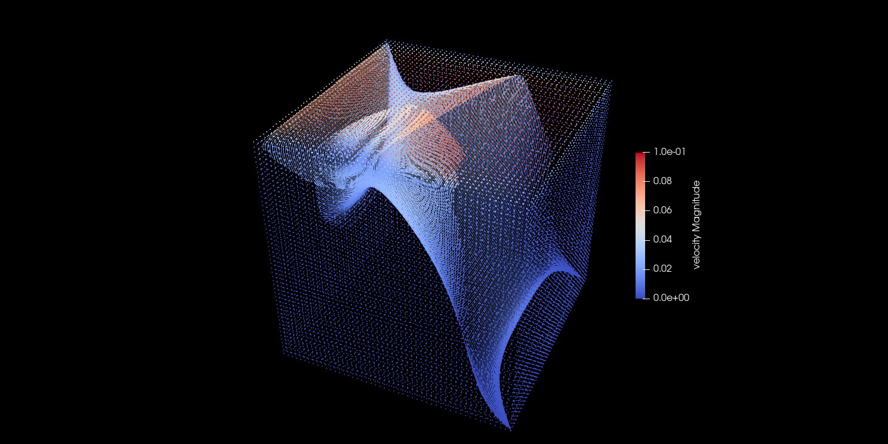

Fluidchen is a CFD Solver developed for the CFD Lab taught at TUM Informatics, Chair of Scientific Computing in Computer Science.

## Software Requirements

* VTK 7 or higher
* GCC 9 (optional)
  
Detailed information is given below.

## Building the Code

```shell
git clone -b Project git@gitlab.lrz.de:00000000014B4D55/group-d-cfd-lab.git GroupD_CFDLab_Project_Siva
cd GroupD_CFDLab_Project_Siva
mkdir build && cd build
cmake ..
make
```

After `make` completes successfully, you will get an executable `fluidchen` in your `build` directory. Run the code from this directory. Note: Earlier versions of this documentation pointed to the option of `make install`. You may want to avoid this and directly work inside the repository while you develop the code.

## Build Options

By default, **fluidchen** is installed in `DEBUG` mode. To obtain full performance, you can execute cmake as

```shell
cmake -DCMAKE_BUILD_TYPE=RELEASE ..
```

or

```shell
cmake -DCMAKE_CXX_FLAGS="-O3" ..
```

A good idea would be that you setup your computers as runners for [GitLab CI](https://docs.gitlab.com/ee/ci/)
(see the file `.gitlab-ci.yml` here) to check the code building automatically every time you push.

## Running and Project information

In order to run **Fluidchen**, the case file should be given as input parameter. Some default case files are located in the `example_cases` directory. 

`Note:` For this project, alongside the Finite Difference method for Navier Stokes equation(FDNS), additionally, the Lattice Boltzman Method has been implemented for a 3-dimensional Lid Driven Cavity scenario. Therefore, all the case files in the `example_cases` directory can be run using the Finite Difference method where as only the 3D Lid Driven Cavity can be run using the Lattice Boltzmann Method. Readers are welcome to extend the following code of LBM to implement rest of the caseslike the Finite Difference solver. To run the Lid Driven Cavity case, navigate to the `build/` directory and run:

```shell
./fluidchen ../example_cases/LidDrivenCavity/LidDrivenCavity.dat
```
Upon running the above command in your shell, you would be asked to chose between two methods: 

1. Lattice Boltzman Method
2. Finite Difference Method - Navier Stokes

Enter the number corresponding to the `method` (1 for LBM and 2 for FD) and hit `Enter` to start executing your case using the chosen method.
This will run the case file and create the output folder `../example_cases/LidDrivenCavity/method_LidDrivenCavity_Output` which holds the `.vtk` files of the solution. The output folder is created in the same location as your case file. Note that this may require write permissions in the given directory.

If input file does not contain a geometry file, fluidchen will run lid-driven cavity case with given parameters.

`Note:`Lattice Boltzmann Method works for velocities much smaller than the speed of sound. In our case, we have fixed the speed of sound to be 1/sqrt(3) = 0.577 (check LBDefinitions.hpp). Therefore, the speed of the moving wall should be much lower than this and I have chosen it to be 0.1

## Cases with special obstacles or boundary conditions - only for Finite Difference Method
An extra parameter with name "geo_file" needs to be provided to handle cases with obstacles or heated walls or cold walls or adiabatic walls. If no geo_file parameter is provided in the .dat file, the LidDriven Cavity with the parameters in the .dat file would be run automatically.

The user should maintain consistency between the .pgm file with obstacles clearly defined and should have the same number of discretizations in all directions in the .dat. The user should ensure that they use the same numbering in .pgm and in .dat file. For example, if adiabatic wall has number 4 in .pgm file, they should ensure that the adiabatic wall is wall_temp_5 in .dat file. If the pgm file has 80 points in x and 20 points in y, they should ensure that imax is 78 and jmax is 18 in .dat file(2 ghost cells in both directions).

It is upto the user to ensure there are no forbidden cells in the .pgm file. i.e., no obstacle cells should have more than 2 neighboring fluid cells. The script checks for that and exits throwing an error in case there are more than 2 neighboring fluid cells for an obstacle cell or if there is a fluid cell in the ghost layer as we're not dealing with periodic conditions as of now.


### Dependencies for macOS

In macOS, you can use default `clang` compiler. Do not install `gcc` compiler since it might cause problems with the standard library and VTK. Other dependencies can be installed by using `homebrew` package manager as

```shell
brew install cmake
brew install open-mpi
brew install vtk
```

**macOS Troubleshooting**
- In macOS, the default `g++` command is linked to `clang++` command, which means, `g++` command does not run the GCC compiler but the Clang compiler. 
- Setup of GCC compiler is experienced to be cumbersome and clashes with lots of other dependencies, therefore please do not use GCC compiler on this project.
- If CMake cannot find the correct C++ binary, you can set it by
```
export CXX=`which clang++``
export CMAKE_CXX_COMPILER=`which clang++``
```
which is going to set the corresponding environment variables to the path of Clang compiler. Please note that if you run these commands on a terminal session, they are only going to be valid on that terminal session. In order to make these changes permanent, you can add these lines to your `~/.zshrc` file.
- Although installation of VTK looks simple, sometimes it is possible that CMake cannot find some necessary libraries for VTK, most famous one being Qt5. If you face an error something like:
```
CMake Error at /usr/local/lib/cmake/vtk-9.0/VTK-vtk-module-find-packages.cmake:115 (find_package):
 By not providing "FindQt5.cmake" in CMAKE_MODULE_PATH this project has
 asked CMake to find a package configuration file provided by "Qt5", but
 CMake did not find one.

 Could not find a package configuration file provided by "Qt5" (requested
 version 5.15) with any of the following names:

   Qt5Config.cmake
   qt5-config.cmake

 Add the installation prefix of "Qt5" to CMAKE_PREFIX_PATH or set "Qt5_DIR"
 to a directory containing one of the above files.  If "Qt5" provides a
 separate development package or SDK, be sure it has been installed.

```
which means that CMake could not find Qt5. Solution is simple fortunately. First, make sure that you have Qt5 installed:
```
brew install qt5
```
Then extend `CMAKE_PREFIX_PATH`, which are the locations where CMake tries to find packages, by adding following lines to your `.zshrc` file
```
export CMAKE_PREFIX_PATH="/usr/local/opt/qt5:$CMAKE_PREFIX_PATH"
```
Please not that your installation might be in another location. The most possible another location is `/usr/local/Cellar/qt@5/5.**.*/`, which depends on the Qt5 version. 

### Dependencies for macOS with M1 chip

MacOS with M1 chip has problems with finding qt5 and it does not support virtual machine. Because of that, Docker should be installed from the following webpage.

https://docs.docker.com/desktop/mac/install/

After installing Docker, the Dockerfile which is already provided in the project should be used. Docker application should always be open during working on the code. 
To build the code, user should right click on the Dockerfile in the project and select the 'build image' option. After that user should select a name for that image and after selecting, the image is created in the Images section in Docker file. 

To run the code:

```
docker run -i -p 80:80 -v <path> name

```
should be run in terminal. Container is generated in container sections in Docker application. 
Code can be run by using that generated container.

### Troubleshooting: VTK not found

You might run into a problem where the VTK library is not found. To fix this, you can try the following steps:

1. Find the installation path of your VTK library 
2. Define this path as an environment variable, as e.g. `export VTK_DIR=".../lib/cmake/vtk-8.2"`
3. Start in a clean build folder
4. Run `cmake ..` again

### Set a different GCC version

If you have multiple compiler versions installed you can set the GCC version which should be used by `cmake` like this:

```shell
export CXX=`which g++-7`
```

Make sure to use a backtick (\`) to get the `which` command executed. Afterwards, you can run `cmake ..`.

## Sample Results from the LBM simulation of the Lid Driven Cavity case


Velocity streamlines at t=150 on the midplane of the 3D Lid Driven Cavity case run using the LBM solver



3D streamlines originating from bottom corner of the 3D domain with point-velocity contours for the LBM implementation
